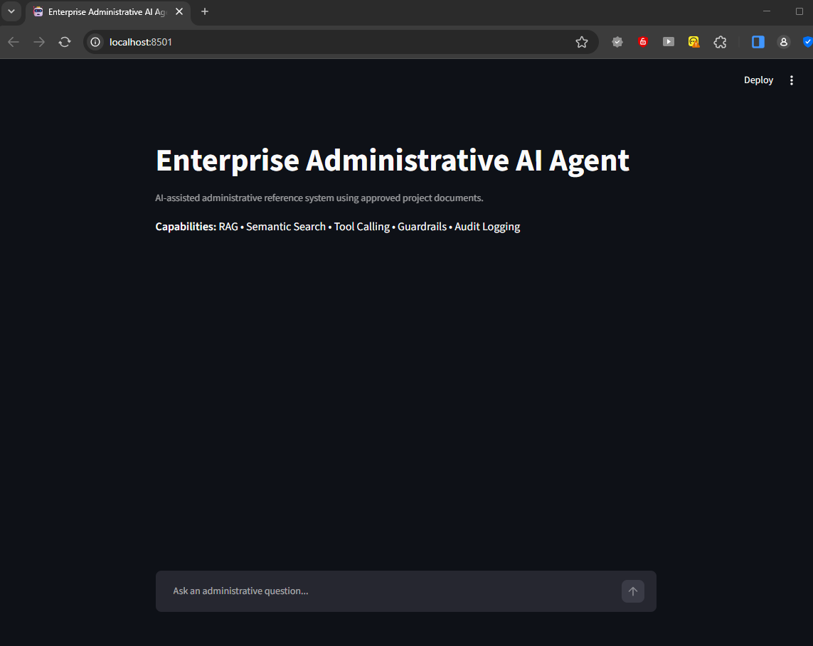
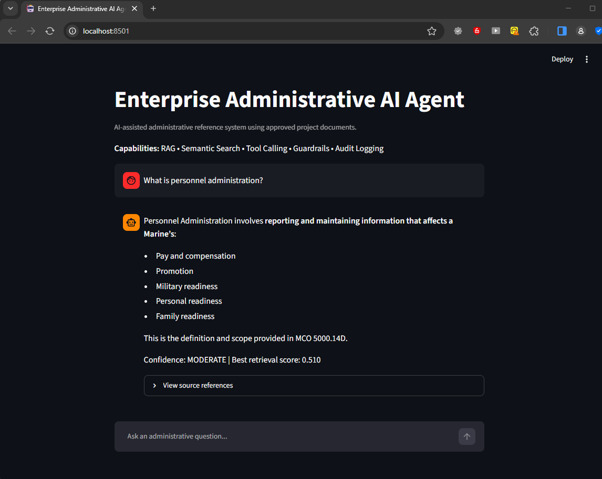
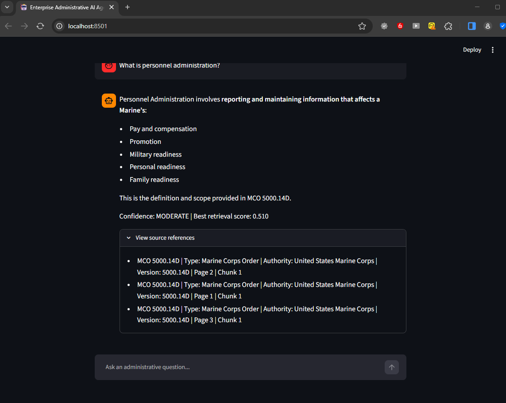
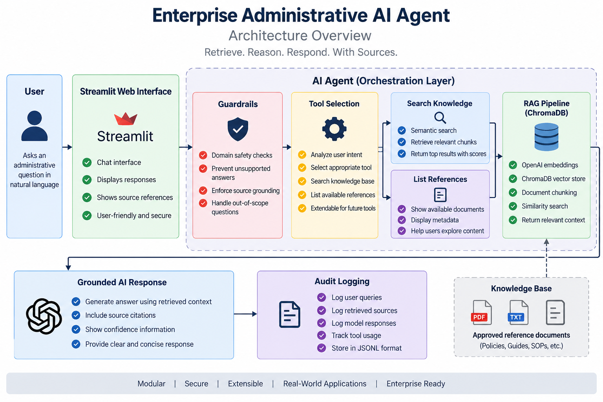

# Enterprise Administrative AI Agent

An AI-powered administrative reference assistant built as a portfolio project to demonstrate enterprise AI engineering concepts using Python, Retrieval-Augmented Generation (RAG), vector search, tool calling, guardrails, audit logging, and a web-based user interface.

## Overview

The Enterprise Administrative AI Agent allows users to ask administrative questions in natural language and receive responses grounded in approved reference documents.

Rather than relying only on the language model's existing knowledge, the application retrieves relevant information from its document knowledge base before generating an answer.

The system is designed to avoid unsupported responses when sufficient reference information is not available.

## Demo

### Application Home



### AI Agent Response



### Source References



## Key Features

- Retrieval-Augmented Generation (RAG)
- Semantic search using OpenAI embeddings
- ChromaDB vector database
- PDF and text document ingestion
- Document chunking
- Source metadata and page tracking
- Retrieval confidence scoring
- AI tool selection
- Administrative knowledge search tool
- Reference document listing tool
- Domain guardrails
- Grounded-response controls
- JSONL audit logging
- Automated retrieval evaluation
- Streamlit chat interface
- Environment-variable protection for API credentials

## Architecture



## Technology Stack

- Python
- OpenAI API
- Streamlit
- ChromaDB
- Retrieval-Augmented Generation (RAG)
- OpenAI Embeddings
- Semantic Search
- Function / Tool Calling
- JSONL Logging
- Environment Variables
- Git
- GitHub

## How It Works

1. A user submits an administrative question through the Streamlit interface.
2. Domain guardrails evaluate whether the question is appropriate for the system.
3. The AI agent selects the appropriate tool.
4. The knowledge-search tool performs semantic retrieval against the approved document knowledge base.
5. Relevant document chunks are retrieved from ChromaDB.
6. The RAG pipeline provides the retrieved context to the language model.
7. The system generates a grounded response using the retrieved reference information.
8. Retrieval confidence and source references are displayed to the user.
9. User questions, tool calls, retrieval activity, and responses are written to the audit log.

## Grounding and Guardrails

The application is designed to reduce unsupported AI responses by requiring the agent to use approved reference tools for administrative questions.

If the available reference documents do not provide sufficient supporting information, the system is designed to avoid presenting unsupported information as fact.

The application also includes domain guardrails to help prevent out-of-scope questions from being processed as administrative reference requests.

## Source Transparency

The RAG pipeline tracks source metadata for retrieved content, including available document information, page references, document versions, and chunk identifiers.

The Streamlit interface allows users to expand the source-reference section and review the references supporting a generated response.

## Audit Logging

The application records key system events in JSONL format, including:

- User questions
- Guardrail events
- Tool calls
- Tool results
- Final responses

This provides a basic audit trail for reviewing how the agent processed a request.

## Project Structure

```text
enterprise-administrative-ai-agent/
│
├── assets/
│   ├── enterprise-admin-ai-agent-home.png
│   ├── enterprise-admin-ai-agent-rag-response.png
│   ├── enterprise-admin-ai-agent-source-references.png
│   └── enterprise-admin-ai-agent-architecture.png
│
├── data/
│   ├── chroma_db/
│   └── embeddings.json
│
├── documents/
│   └── reference documents
│
├── logs/
│   └── agent_audit.jsonl
│
├── agent.py
├── app.py
├── build_embeddings.py
├── chunking.py
├── document_loader.py
├── document_metadata.json
├── document_search.py
├── embedding_search.py
├── eval_rag.py
├── guardrails.py
├── knowledge.json
├── llm.py
├── logger.py
├── main.py
├── matcher.py
├── rag.py
├── requirements.txt
├── semantic_search.py
├── test_agent.py
├── test_llm.py
├── test_rag.py
├── test_tools.py
├── tools.py
└── vector_store.py
```